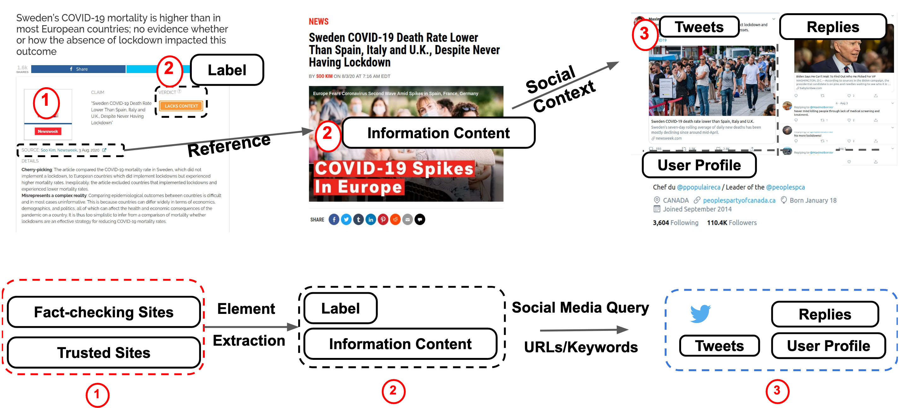

# MM-COVID
[Multilingual and Multimodal COVID-19 Fake News Dataset](https://arxiv.org/abs/2011.04088)

## Data Structure

The data is stored at [Google Drive](https://drive.google.com/drive/folders/1gd4AvT6BxPRtymmNd9Z7ukyaVhae5s7U?usp=sharing)

- news_collection.json: this file stores the information about the fact-checking, news content and news label
- news_tweet_relation.json: this file stores the dicussion of the news content from Twitter
- tweet_tweet_relation.json: this file stores the retweets, recursively replies of the tweets.

Due to the Twitter privacy concerns, we only provide the twitter IDs for the tweets, you can utilize [Twarc](https://github.com/DocNow/twarc) to **Hydrate** these tweet IDs. 

## Crawling Pipeline
This code stored the data into MongoDB. You should pre-install MongoDB before running the code. 

The main file is __FakeNewsCrawler.py__ and the pipeline of this file is as:



#### WorkFlow
1. Use crawler to get all the fake news from the Factchecking server. 
2. Fetch the html page of the source provided in the article and parse and get the "title" of the article
3. Using the title fetched in the previous step and Twitter's advanced search API get tweets matching title using web scrapping
4. For every tweet related to fake news get the favourites, replies, retweets associated with it.
5. For all the users who tweeted those fake tweets, gather the social network information like followers, followees.


## Installation


### Requirements： 

Credits for [FakeNewsNet](https://github.com/KaiDMML/FakeNewsNet).


Mongo db setup - https://docs.mongodb.com/tutorials/install-mongodb-on-ubuntu/

Firefox driver - Geckodriver installation - https://askubuntu.com/questions/870530/how-to-install-geckodriver-in-ubuntu


Data download scripts are writtern in python and requires python 3.6 + to run. 

Twitter API keys are used for collecting data from Twitter. Make use of the following link to get Twitter API keys
https://developer.twitter.com/en/docs/basics/authentication/guides/access-tokens.html

Script make use of keys from tweet_keys_file.json file located in code/resources folder. So the API keys needs to be updated in tweet_keys_file.json file. Provide the keys as array of JSON object with attributes app_key,app_secret,oauth_token,oauth_token_secret as mentioned in sample file.

Install all the libraries in requirements.txt using the following command

```shell script
pip install -r requirements.txt
```

### Running Code
Inorder to collect data set fast, code makes user of process parallelism and to synchronize twitter key limitations across mutiple python processes. 
```shell script
nohup python FakeNewsCrawler.py
```

## References
If you use this dataset, please cite the following paper:

    
    @misc{li2020mmcovid,
      title={MM-COVID: A Multilingual and Multimodal Data Repository for Combating COVID-19 Disinformation}, 
      author={Yichuan Li and Bohan Jiang and Kai Shu and Huan Liu},
      year={2020},
      eprint={2011.04088},
      archivePrefix={arXiv},
      primaryClass={cs.SI}}
If you have any questions about this dataset, please contact Yichuan Li (yli29@wpi.edu).
  
